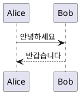

# MDV is markdown viewer

- Requiremenets: Windows, MacOS
- Build Environment: tauri

## 동작방식

- md파일을 더블클릭
- mdv가 실행되어 md 파일을 html로 렌더링 해서 표시
- html 렌더링은 해당 OS의 내장된 WebView를 활용한다

---

## 구현: MDV

Tauri 2 + Rust + TypeScript로 만든 읽기 전용 Markdown 뷰어입니다. Windows에서는 WebView2, macOS에서는 WKWebView로 화면을 표시합니다.

### 기능

- `.md`, `.markdown`, `.mdown` 파일 연결과 더블클릭 실행
- 실행 중인 앱에서 새 파일 열기, 파일 선택, 드래그 앤 드롭, `Ctrl+O` / `Cmd+O`
- GFM 표, 코드 블록, 목차, 문서 내 링크, 같은 폴더의 상대 경로 이미지
- 다른 Markdown 문서로 이동, 외부 링크는 기본 브라우저에서 열기
- 최근 열어본 파일 10개 저장 및 다시 열기, 개별 삭제와 전체 목록 지우기
- 밝은/어두운 테마 저장, 다시 읽기 버튼
- Mermaid/MermaidJS 코드 블록의 오프라인 다이어그램, PlantUML/PUML 코드 블록의 온라인 다이어그램
- HTML 정제 및 CSP 적용, UTF-8 문서 지원(최대 10MB)

### 개발 환경

Node.js 22 이상, Rust 1.88 이상(최신 stable 권장)과 [Tauri 플랫폼별 필수 도구](https://v2.tauri.app/start/prerequisites/)가 필요합니다.

- Windows: Microsoft C++ Build Tools와 WebView2
- macOS: Xcode Command Line Tools

```sh
npm ci
npm run tauri dev
```

웹 화면만 확인하려면 `npm run dev`를 실행합니다. 웹 모드에서는 파일 선택/드롭으로 문서를 읽을 수 있지만, 네이티브 파일 연결과 로컬 이미지 접근은 데스크톱 앱에서 동작합니다. 최근 파일 목록은 데스크톱 앱에서 재실행 후에도 유지되며, 웹 모드에서는 현재 브라우저 세션 동안만 유지됩니다. 목록에서 삭제해도 실제 파일은 삭제되지 않습니다.

### 설치 파일 만들기

각 대상 OS에서 실행하세요.

```sh
npm run tauri build
```

결과는 `src-tauri/target/release/bundle/`에 생성됩니다(Windows MSI/NSIS, macOS DMG/app). `.github/workflows/build.yml`은 Windows/macOS 빌드와 설치 파일 아티팩트 업로드를 수행합니다. macOS CI 기본 산출물의 아키텍처는 러너에 따릅니다. Intel Mac용은 Intel 환경 또는 해당 Rust 타깃을 추가하여 별도 빌드하세요. 배포 서명·공증은 아직 설정하지 않았습니다.

설치 후 파일 연결을 선택하세요.

- Windows: `.md` 파일 → 연결 프로그램 → MDV → 항상 사용
- macOS: `.md` 파일 → 정보 가져오기 → 다음으로 열기 → MDV → 모두 변경

앱은 기존 기본 프로그램 설정을 강제로 덮어쓰지 않습니다. 개발 서버만 실행한 상태에서는 설치용 파일 연결이 등록되지 않습니다.

### 검증

```sh
npm test
npm run build
cargo fmt --manifest-path src-tauri/Cargo.toml -- --check
```

실제 Windows/macOS에서는 설치 후 다음을 확인하세요.

1. 앱이 꺼진 상태에서 공백·한글이 포함된 경로의 `.md` 파일을 더블클릭합니다.
2. 앱이 열린 상태에서 다른 `.md` 파일을 더블클릭하고 기존 창의 내용이 바뀌는지 확인합니다.
3. 파일 선택, 드래그 앤 드롭, 다시 읽기, 상대 이미지, 목차와 링크를 확인합니다.
4. 없는 파일, UTF-8이 아닌 파일, 10MB 초과 파일에 오류가 표시되는지 확인합니다.

로컬 이미지는 열린 문서의 폴더와 하위 폴더에서 읽습니다. 문서는 수정하지 않습니다. 파일 변경 자동 감지, PDF 내보내기, 수식 렌더링은 포함하지 않습니다.

### Markdown 다이어그램

`mermaid` 또는 `mermaidjs` 코드 블록은 앱 안에서 자동으로 렌더링합니다. 별도 설치나 인터넷 연결이 필요하지 않습니다. 밝은/어두운 테마를 전환하면 다이어그램도 갱신됩니다.

````markdown



````

`plantuml` 또는 `puml` 블록은 **plantuml.com에 전송하여 그리기** 버튼을 누르면 온라인 서버에서 SVG 이미지로 렌더링합니다. 해당 블록의 코드가 공개 PlantUML 서버로 전송되므로, 외부로 보내면 안 되는 내용에는 사용하지 마세요. 문서를 열 때 자동 전송하지 않으며, Java 설치는 필요하지 않습니다. 인터넷 연결이 필요하고 서버 장애 또는 요청 길이 제한으로 실패할 수 있습니다. 로컬 파일을 참조하는 `!include`는 지원하지 않습니다.

모든 다이어그램에서 **소스 보기**로 원문을 확인할 수 있습니다. 렌더링이 실패해도 나머지 문서를 읽을 수 있으며 소스가 표시됩니다.

구현 참고: [Mermaid API](https://mermaid.js.org/config/usage), [PlantUML 인코딩 형식](https://plantuml.com/text-encoding).
